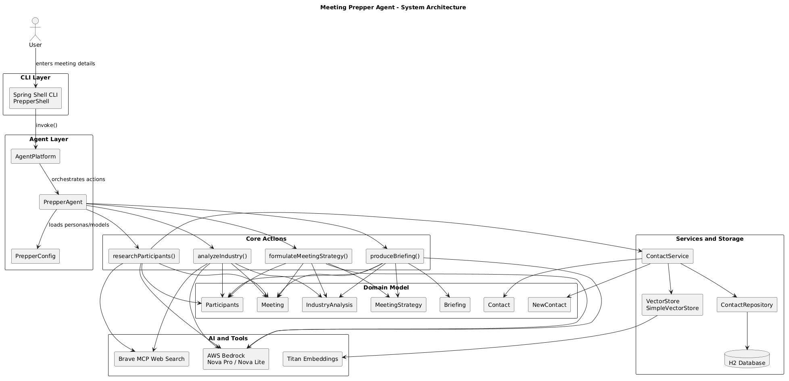
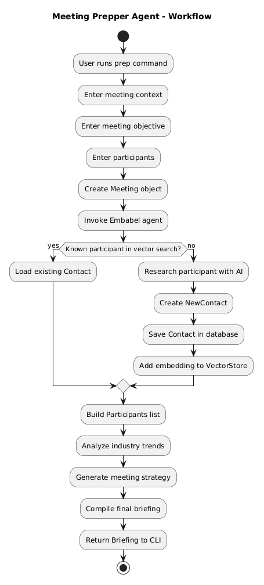
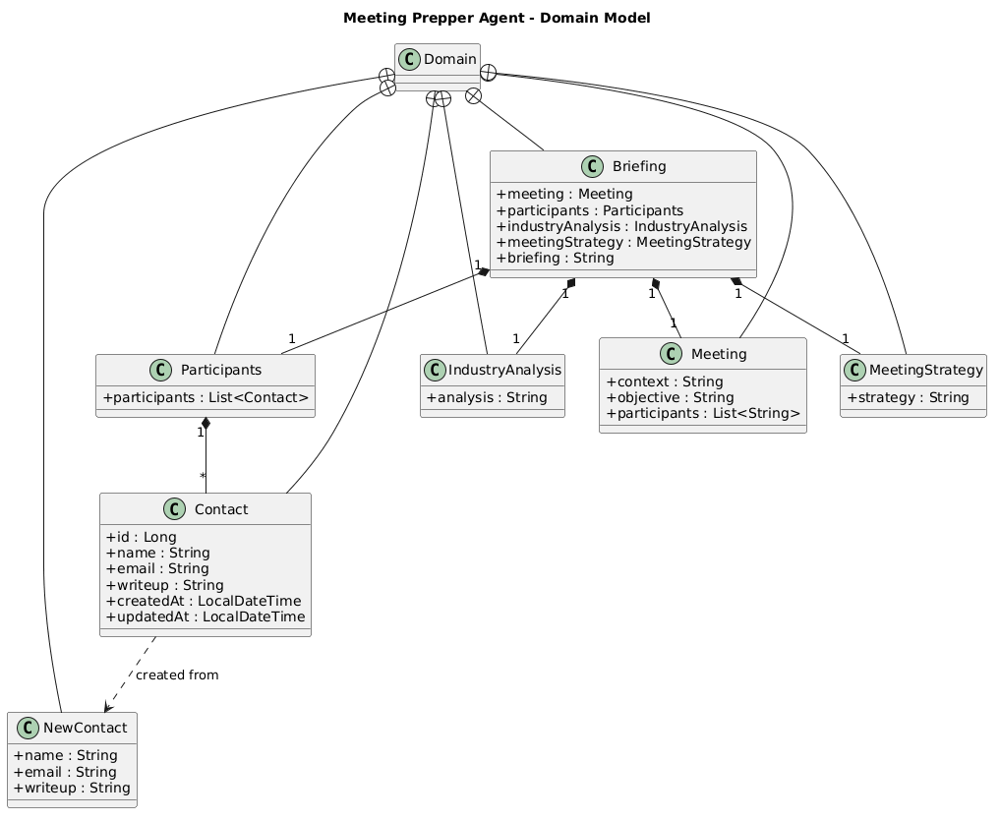
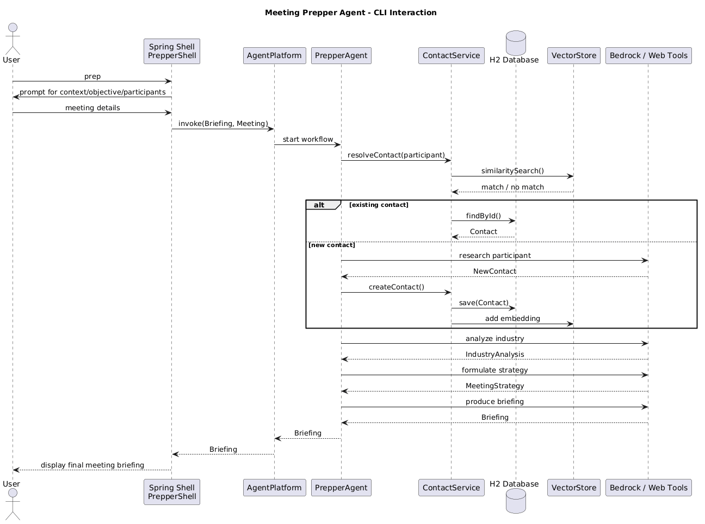

# Meeting Prepper Agent
### AI-Powered Meeting Preparation using Spring AI, Embabel and AWS Bedrock

# Project Overview

This project implements an **AI-powered meeting preparation assistant** using the **Embabel Agent Framework** built on top of **Spring AI**.

The system automatically generates a **meeting briefing** by orchestrating multiple AI tasks such as:

- researching meeting participants
- analyzing industry trends
- generating strategic discussion points
- compiling a final briefing document

Instead of using static prompt chains, the system uses **agent orchestration**, allowing the AI to dynamically decide which actions to perform to achieve its goal.

---

# System Architecture

The system follows a layered architecture consisting of an agent platform, AI models, data storage, and external tools.

Core layers include:

| Layer | Description |
|------|-------------|
| CLI Interface | User interaction via Spring Shell |
| Agent Platform | Orchestrates actions and goals |
| Agent Actions | AI tasks executed by the agent |
| Data Services | Contact database and vector store |
| AI Models | AWS Bedrock models |
| Tools | Web search via MCP |

---

# Agent Workflow

The agent executes several coordinated actions to generate the final briefing.

Workflow steps:

1. Research meeting participants
2. Analyze industry trends
3. Develop meeting strategy
4. Generate final briefing document

Each step is implemented as an **Embabel Action**.

---

# Domain Model

The project uses **domain-driven design** to represent meeting preparation data.

Key domain objects include:

| Model | Purpose |
|------|---------|
Meeting | Represents the meeting details |
Contact | Stores participant information |
Participants | Collection of contacts |
IndustryAnalysis | Industry insights |
MeetingStrategy | Strategic discussion points |
Briefing | Final generated meeting report |

Example simplified domain record:

Meeting
├ context
├ objective
└ participants

---

# Technologies Used

| Technology | Purpose |
|-----------|---------|
Java 25 | Application runtime |
Spring Boot | Application framework |
Spring AI | AI integration |
Embabel | Agent orchestration |
AWS Bedrock | Large language models |
Nova Pro | High quality reasoning model |
Nova Lite | Balanced LLM |
Titan Embeddings | Vector search embeddings |
H2 Database | Contact storage |
Spring Data JDBC | Data persistence |
SimpleVectorStore | Semantic search |
Spring Shell | CLI interface |
Brave MCP | Web search tools |

---

# Project Structure

prepper
│
├── src
│ ├── main
│ │ ├── java/com/embabel/prepper
│ │ │ ├── agent
│ │ │ │ ├── Domain.java
│ │ │ │ ├── ContactService.java
│ │ │ │ ├── PrepperAgent.java
│ │ │ │ └── PrepperConfig.java
│ │ │ │
│ │ │ ├── shell
│ │ │ │ └── PrepperShell.java
│ │ │ │
│ │ │ └── PrepperApplication.java
│ │ │
│ │ └── resources
│ │ ├── application.properties
│ │ ├── schema.sql
│ │ └── models/additional-bedrock.yaml

---

# AI Personas

The agent uses **AI personas** to guide model behavior.

| Persona | Role |
|-------|------|
Research Specialist | Research meeting participants |
Industry Analyst | Analyze industry trends |
Meeting Strategy Advisor | Generate discussion strategy |
Briefing Coordinator | Compile final briefing |

Example persona configuration:

prepper.researcher.persona.role=Research Specialist
prepper.researcher.persona.goal=Conduct research on meeting participants

Personas help the AI produce more focused and consistent outputs.

---

# Vector Search for Participant Resolution

The system uses **semantic search** to resolve participants using embeddings.

Process:

1. Convert participant text into embeddings
2. Store embeddings in vector store
3. Perform similarity search
4. Retrieve matching contact from database

Benefits include:

- fuzzy name matching
- natural language contact lookup
- improved participant resolution

---

# Database Layer

Participant information is stored in an **H2 in-memory database**.

Fields include:

- name
- email
- description
- creation timestamp
- update timestamp

Example schema structure:

contact
├ id
├ name
├ email
├ writeup
├ created_at
└ updated_at

Contacts are automatically created when the agent researches unknown participants.

---

# Web Search Integration

The system integrates **Brave MCP Web Search tools**.

This enables the agent to:

- search the web
- retrieve current information
- enrich participant research
- improve industry analysis

Example configuration:

prepper.researcher.tool-groups=web
prepper.industry-analyzer.tool-groups=web

---

# Running the Application

Start the application:

./mvnw spring-boot:run

This launches the **Embabel interactive shell**.

---

# CLI Commands

The following commands are available inside the shell.

| Command | Description |
|------|-------------|
models | list available AI models |
agents | list registered agents |
tools | list installed tools |
contacts | list stored contacts |
findcontact | search for participant |
prep | run meeting preparation agent |

---

# Example Usage

Run the agent:

prep

Provide meeting information:

Enter meeting context/title:
Spring AI

Enter meeting objective:
Learn about AI agents

Enter participants:
Josh Long
done

The agent will generate a **meeting briefing**.

Example CLI session:

---

# Generated Briefing

The final briefing includes:

- participant insights
- industry analysis
- strategic discussion points
- recommended questions

This allows users to quickly prepare for meetings with minimal manual research.

---

# Infrastructure Cleanup

After completing the workshop the resources can be removed.

Cleanup script:

~/java-on-aws/infra/scripts/deploy/java-spring-ai-agents/cleanup.sh

Delete the CloudFormation stack:

aws cloudformation delete-stack --stack-name workshop-stack
aws cloudformation wait stack-delete-complete --stack-name workshop-stack

---

# Key Takeaways

This project demonstrates how modern frameworks can be used to build **goal-driven AI agents** capable of orchestrating complex tasks.

Important capabilities include:

- agent orchestration
- structured domain modeling
- AI persona configuration
- semantic search
- web tool integration
- automated report generation

These techniques can be extended to build more advanced AI assistants and business automation systems.

---
